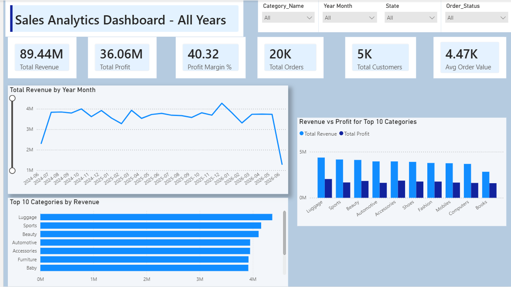

# Amazon Sales Analysis using PostgreSQL

## Project Overview

This project simulates an Amazon-style e-commerce database and performs business analysis using PostgreSQL. The dataset was generated using Python and Faker to create realistic sales, customer, product, inventory, payment, and shipping data.

The project demonstrates:

* Database design and normalization
* Synthetic data generation
* Data validation and integrity checks
* SQL-based business analysis
* Revenue and customer insights

---

## Database Schema

The database contains the following tables:

| Table       | Description                     |
| ----------- | ------------------------------- |
| Customers   | Customer information            |
| Sellers     | Seller and brand information    |
| Category    | Product categories              |
| Products    | Product catalog                 |
| Inventory   | Stock and warehouse information |
| Orders      | Customer orders                 |
| Order_Items | Products within each order      |
| Payments    | Payment transactions            |
| Shipping    | Delivery and return information |

### Entity Relationship Diagram (ERD)


---

## Dataset Information

Synthetic dataset generated using Python and Faker.

| Table       | Records |
| ----------- | ------- |
| Customers   | 5,000   |
| Sellers     | 500     |
| Categories  | 25      |
| Products    | 1,000   |
| Inventory   | 1,000   |
| Orders      | 20,000  |
| Order Items | 60,000+ |
| Payments    | 20,000  |
| Shipping    | 20,000  |

---

## Technologies Used

* PostgreSQL
* Python
* Faker
* Pandas
* Git
* GitHub

---

## Data Validation

Several data quality checks were performed:

### Products with invalid pricing

```sql
SELECT *
FROM products
WHERE cogs > price;
```

### Returned orders not refunded

```sql
SELECT *
FROM orders o
JOIN payments p
ON o.order_id = p.order_id
WHERE o.order_status='Returned'
AND p.payment_status<>'Refunded';
```

### Inventory products missing from products table

```sql
SELECT *
FROM inventory i
LEFT JOIN products p
ON i.product_id=p.product_id
WHERE p.product_id IS NULL;
```
---

## Business Analysis Performed

### Sales Performance Analysis

- Total Revenue
- Total Profit
- Profit Margin
- Average Order Value
- Monthly Revenue Trend

### Product Analysis

- Top Selling Products
- Revenue by Category
- Product Profitability Analysis
- Category Contribution Analysis

### Customer Analysis

- Top Customers
- Revenue by State
- Customer Distribution Analysis
- Repeat Customer Analysis

### Inventory Analysis

- Low Stock Products
- Inventory Replenishment Requirements

---

# Power BI Dashboards

The project includes three interactive Power BI dashboards designed for business stakeholders.

---

## Dashboard 1: Executive Summary

### Key KPIs

- Total Revenue
- Total Profit
- Profit Margin %
- Total Orders
- Total Customers
- Average Order Value

### Visualizations

- Revenue Trend Analysis
- Revenue by Category
- Revenue vs Profit by Category
- Top Revenue-Generating Categories

### Dashboard Preview



---

## Dashboard 2: Product Intelligence

### Key KPIs

- Total Products
- Average Product Revenue
- Highest Revenue Category
- Most Sold Product
- Highest Profit Product

### Visualizations

- Top Products by Revenue
- Top Products by Quantity Sold
- Category Revenue Contribution
- Revenue vs Profit by Category

### Dashboard Preview


---

## Dashboard 3: Customer Insights

### Key KPIs

- Total Customers
- Revenue per Customer
- Top Customer
- Repeat Customer Rate

### Visualizations

- Top Customers by Revenue
- Revenue by State
- Customer Distribution by State
- Geographic Revenue Analysis

### Dashboard Preview


---

## Key Insights

### Revenue Insights

- Identified top-performing product categories driving overall sales.
- Analyzed monthly revenue trends to detect growth patterns and seasonality.
- Measured profitability across categories and products.

### Product Insights

- Determined highest revenue-generating products.
- Identified categories with the strongest profit margins.
- Evaluated category contribution to overall business performance.

### Customer Insights

- Identified high-value customers contributing the largest share of revenue.
- Analyzed customer distribution across states.
- Measured customer spending behavior and average customer value.

### Inventory Insights

- Detected low-stock products requiring replenishment.
- Improved visibility into inventory management requirements.

---

## Repository Structure

```text
amazon-sales-analysis/
│
├── data/
│
├── sql/
│   ├── 01_create_tables.sql
│   ├── 02_data_validation.sql
│   └── 03_business_queries.sql
│
├── powerbi/
│   └── Amazon_Sales_Analytics.pbix
│
├── screenshots/
│   ├── erd.png
│   ├── dashboard_1_executive_summary.png
│   ├── dashboard_2_product_intelligence.png
│   └── dashboard_3_customer_insights.png
│
├── generate_dataset.py
│
└── README.md
```

---

## Future Enhancements

- Automated ETL Pipeline
- PostgreSQL Views & Materialized Views
- Customer Segmentation (RFM Analysis)
- Sales Forecasting
- Power BI Service Deployment
- Incremental Refresh
- Cloud Data Warehouse Integration
- ML-Based Demand Forecasting

---

## Author

**Sakina Rizvi**

Data Analytics | SQL | PostgreSQL | Power BI | Python