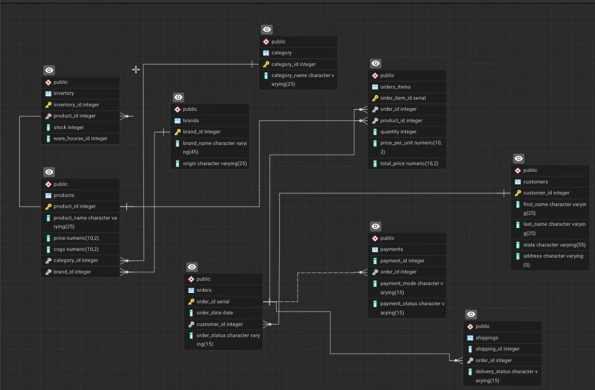

# Amazon Sales Analysis using PostgreSQL

## Project Overview

This project simulates an Amazon-style e-commerce database and performs business analysis using PostgreSQL. The dataset was generated using Python and Faker to create realistic sales, customer, product, inventory, payment, and shipping data.

The project demonstrates:

* Database design and normalization
* Synthetic data generation
* Data validation and integrity checks
* SQL-based business analysis
* Revenue and customer insights

---

## Database Schema

The database contains the following tables:

| Table       | Description                     |
| ----------- | ------------------------------- |
| Customers   | Customer information            |
| Sellers     | Seller and brand information    |
| Category    | Product categories              |
| Products    | Product catalog                 |
| Inventory   | Stock and warehouse information |
| Orders      | Customer orders                 |
| Order_Items | Products within each order      |
| Payments    | Payment transactions            |
| Shipping    | Delivery and return information |

### Entity Relationship Diagram (ERD)



---

## Dataset Information

Synthetic dataset generated using Python and Faker.

| Table       | Records |
| ----------- | ------- |
| Customers   | 5,000   |
| Sellers     | 500     |
| Categories  | 25      |
| Products    | 1,000   |
| Inventory   | 1,000   |
| Orders      | 20,000  |
| Order Items | 60,000+ |
| Payments    | 20,000  |
| Shipping    | 20,000  |

---

## Technologies Used

* PostgreSQL
* Python
* Faker
* Pandas
* Git
* GitHub

---

## Data Validation

Several data quality checks were performed:

### Products with invalid pricing

```sql
SELECT *
FROM products
WHERE cogs > price;
```

### Returned orders not refunded

```sql
SELECT *
FROM orders o
JOIN payments p
ON o.order_id = p.order_id
WHERE o.order_status='Returned'
AND p.payment_status<>'Refunded';
```

### Inventory products missing from products table

```sql
SELECT *
FROM inventory i
LEFT JOIN products p
ON i.product_id=p.product_id
WHERE p.product_id IS NULL;
```

---

## Business Analysis Questions

### 1. Top Selling Products

Identify products generating the highest revenue.

### 2. Revenue by Category

Analyze category-wise revenue contribution.

### 3. Monthly Revenue Trend

Track sales performance over time.

### 4. Top Customers

Identify customers contributing the most revenue.

### 5. Average Order Value

Calculate average customer spending per order.

### 6. Seller Performance

Evaluate seller revenue and order volume.

### 7. Inventory Analysis

Identify low-stock products requiring replenishment.

---

## Sample Insights

* Electronics generated the highest revenue.
* Average Order Value exceeded $X.
* Top 10 customers contributed Y% of total revenue.
* Category Z showed the highest growth.
* X products require inventory replenishment.

---

## Repository Structure

amazon-sales-analysis/

├── data/

├── sql/

│ ├── 01_create_tables.sql

│ ├── 02_data_validation.sql

│ └── 03_business_queries.sql

├── screenshots/

├── README.md

└── generate_dataset.py

---

## Future Improvements

* Power BI dashboard integration
* Star schema implementation
* ETL pipeline automation
* Customer segmentation analysis
* Forecasting and predictive analytics

---

## Author

Sakina Rizvi
